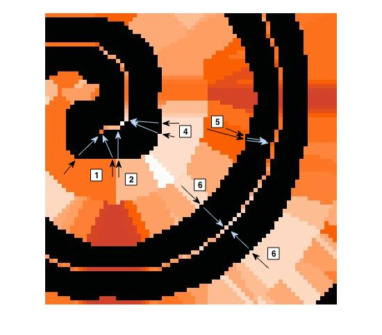

.. tutorial_distmap:

************************
Getting Started: distmap
************************

**I. OVERVIEW**

Generalizing, the 'RP_distmap' analysis associates every non-mask pixel with the nearest medial axis of a mask object.  In the context of a soil-plant system, this means that every soil (i.e. non-segmented, non-root) pixel is associated with a root diameter.  

This analysis is done in two steps: firstly, a non-mask (i.e. "soil") pixel is associated with a contour of a mask object.  Secondly, this contour pixel is then associated with a medial axis within the mask object.  In the image below, note how each set of arrows, grouped by number, operate:

The black arrow indicates the first step, where the pixel is associated with its nearest mask contour.  The blue arrow then associates that pixel with the medial axis (colored above for reference).  Different colors indicate different medial axis sizes.  This effectively creates "zones of influence" for each mask section/medial axis.  

**II. HOW TO USE**

First, open the 'user_config' text file in your 'Root_Processing' directory.  The parameters used in 'RP_distmap' are in the 6th section, and there will be three parameters.  In order, they are:

1. image_filename: this is the full image filename (including directory) where the image is to be found.  

2. output_filename: this is the full image filename (including directory) where the image is to be saved.  If the directory is not present, the analysis will automatically make the directory.  

3. maxval: this indicates the maximum non-mask/mask contour distance to be evaluated, above which all non-mask pixels will be ignored.  This effectively delimits the "zone of influence" for each mask.  This is primarily to save time on analyses for very large images.

**III. RUNNING THE CODE**

This analysis can be conducted using the ['RP_distmap'] string in the 'RP_run' module.  