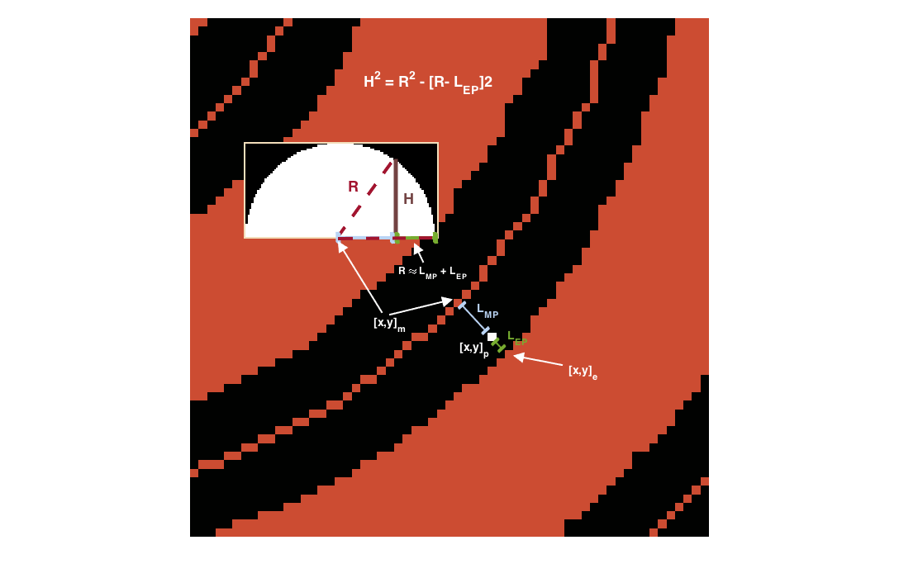

.. tutorial_thickness:

***************************
Getting Started: thickness
***************************

**I. OVERVIEW**

The 'RP_thickness' analysis creates a half-thickness image froma  binary segmented image, assuming a cylindrical shape.  

In this analysis, a skeleton (i.e. medial axis transform) of the binary image is calculated.  A distance transform of the root is then calculated - the distance transform on the medial axis pixel is labeled a "root radius" value R.  

From here, for every pixel [x, y]_p, the following are calculated:

    - (1): [x, y]_m - medial axis pixel closest to [x, y]_p
    - (2): [x, y]_e - object pixel closest to [x, y]_p
    - (3): L_MP - distance from [x, y]_m to [x, y]_p
    - (4): L_EP - distance from [x, y]_e to [x, y]_p

*Outline of the individual components in the thickness analysis.*

We assume that L_MP and L_EP are on an equal plane, thereby making R = L_MP + L_EP.  Then, assuming a cylindrical distribution around the medial axis, we can calculate the half-dome height H of the pixel as follows:

.. math:: H^2 = R^2 - (R- L_EP)^2

.. image:: _static/thickness_final.png
   
*Final product of the thickness analysis, with a 3D surface image of a selected area.  Note that the surface image is not 3D due to different scaling between the z and xy axis.*

**II. HOW TO USE**

First, open the 'user_config' text file in your 'Root_Processing' directory.  The parameters used in 'RP_thickness' are in the 8th section, and there will be two parameters.  In order, they are:

1. image_filename: this is the full image filename (including directory) where the image is to be found.  

2. output_filename: this is the full image filename (including directory) where the image is to be saved.  If the directory is not present, the analysis will automatically make the directory.  

**III. RUNNING THE CODE**

This analysis can be conducted using the ['RP_thickness'] string in the 'RP_run' module.  